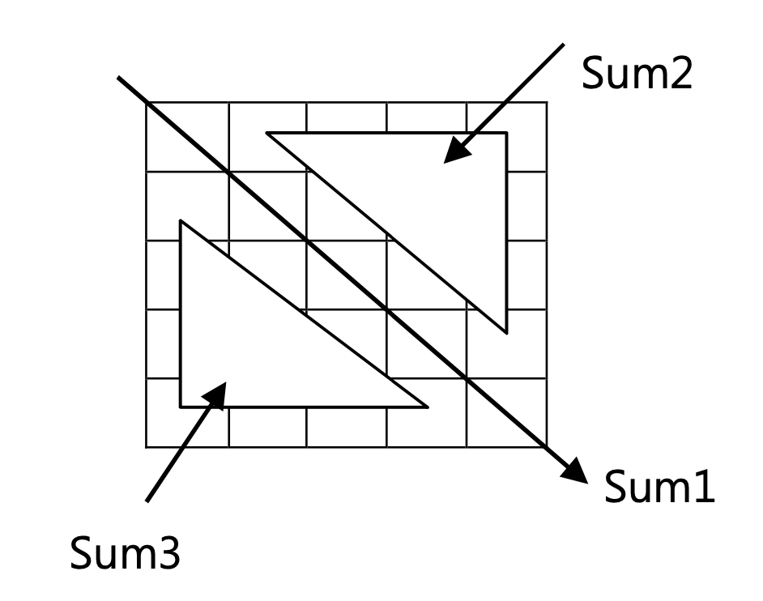

# [HW56] 배열의 부분합 구하기 (이차원배열 이용)


<h4>

int형 5행 5열짜리 2차원 배열을 선언하여 1~20까지의 난수(random number)를 발생시켜 초기화 한 후 다음의 각각의 합을 구하시오.</br></br></h4>



<h4>
(사용함수)</br></br>
1. 배열초기화 함수:5행 5열짜리 배열을 난수를 발생시켜 행우선 순으로 초기화 하는 함수 </br>
2. 배열의 각 부분합을 구하는 함수</br>
3. 결과 출력 함수</br>
그 외 필요하다고 판단되는 함수 추가 작성 가능


</br></br>
(실행결과)
</br></br></h4>

```cpp
0번행:x x x x x 
1번행:x x x x x 
2번행:x x x x x 
3번행:x x x x x 
4번행:x x x x x

sum1 = xx 
sum2 = xx 
sum3 = xx

```
